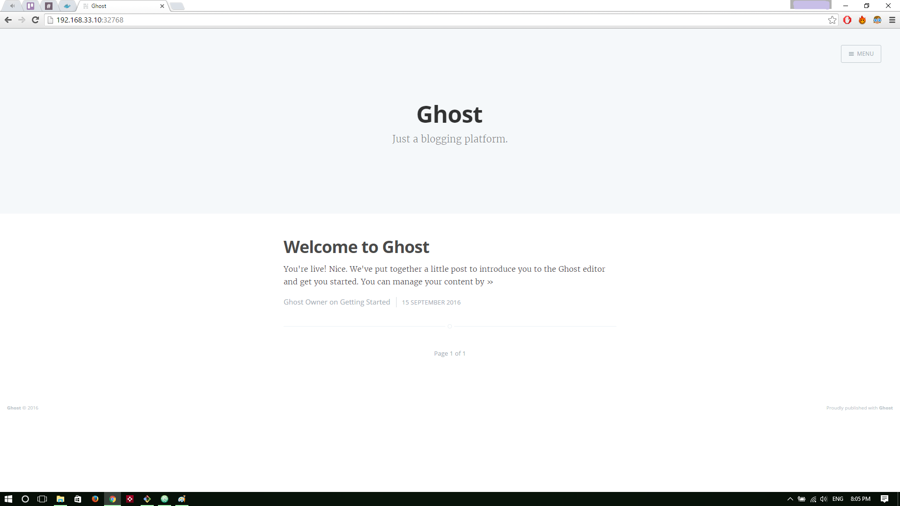
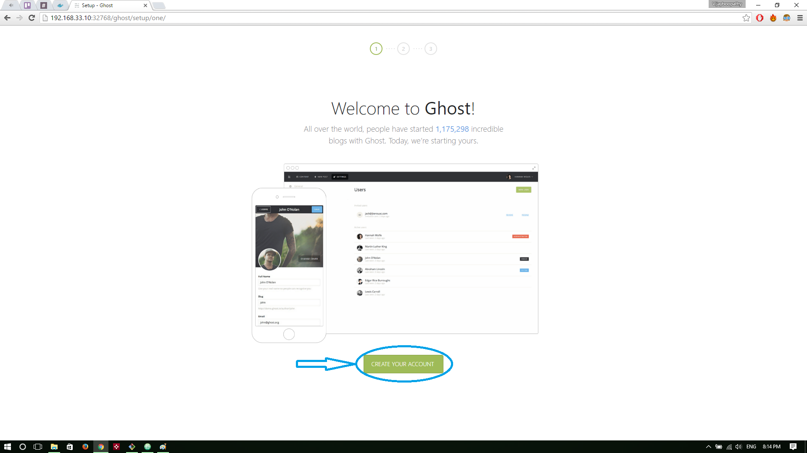
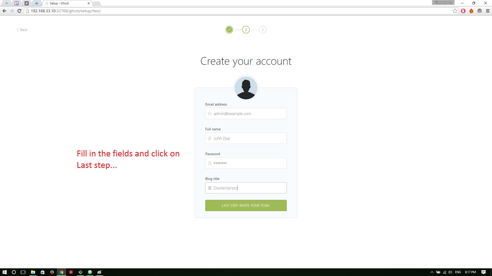
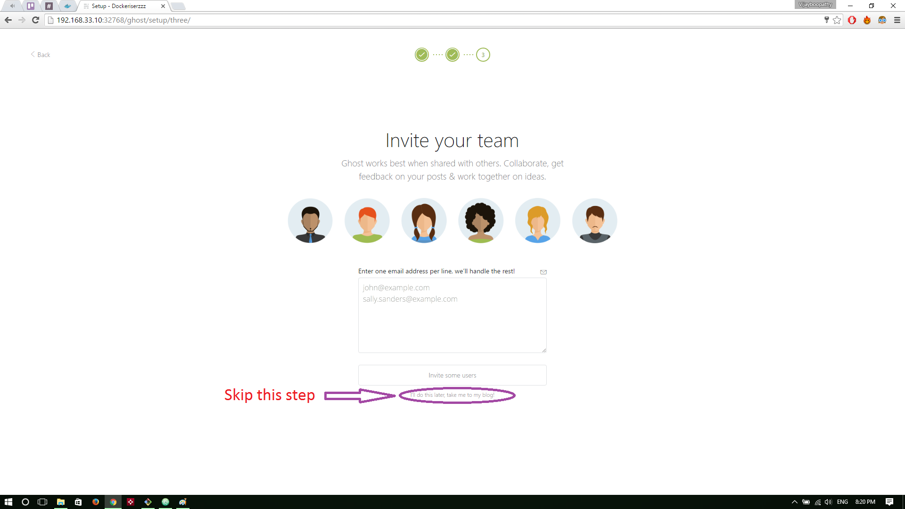
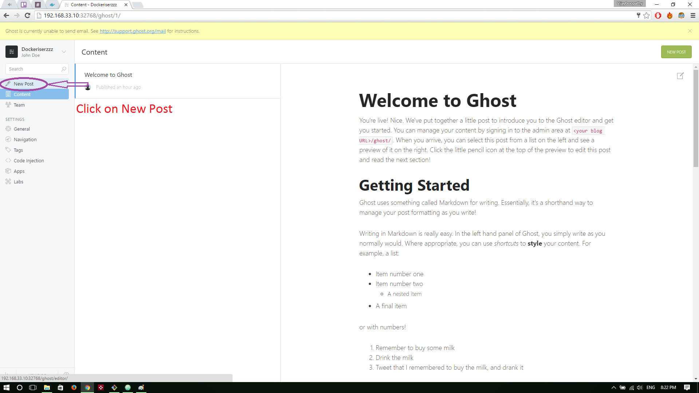
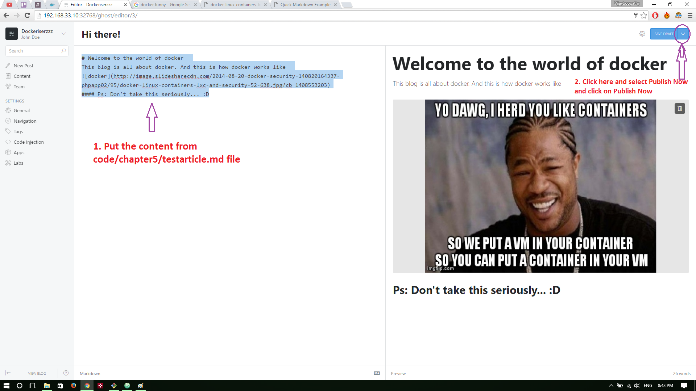

# Managing Containers - Learning about Common Container Operations

In the previous chapter, we have learnt about container lifecycle management including how to create, launch, connect to, stop and remove containers. In this chapter, we are going to learn how to launch a container with a pre built app image and how to access the app with published ports. We will also learn about common container operations such as inspecting container information, checking logs and performance stats, renaming and updating the properties of a container, limiting resources etc.  

As part of the tutorial, we are going to setup a shiny new blogging/publishing site. To set it up, we will use a node.js based framework called **ghost**, a simple, fast, and SEO friendly alternative to more sophisticated publishing platforms such as wordpress. However, its purely gives us a blogging platform.  

### Launching a container with a pre built app image  

To launch ghost container run the following command. Don't bother about the new falg **-P** now. We will explain about that flag later in ths chapter  
```
docker run -d -P ghost:0.10.1
```  
[Output]  

```
Unable to find image 'ghost:0.10.1' locally
0.10.1: Pulling from library/ghost

8ad8b3f87b37: Pull complete
751fe39c4d34: Pull complete
3c8031bea3fa: Pull complete
854b52827bb4: Pull complete
f2c2db6ff75a: Pull complete
8e874614dce5: Pull complete
3aa1c5caad55: Pull complete
0cb1edc0454a: Pull complete
6d8ba59589a6: Pull complete
bff20c590458: Pull complete
Digest: sha256:2258f67d3cc513dbf205d5e793e6a9d7359ba28cf16fc5dce08b4e5d2b982245
Status: Downloaded newer image for ghost:0.10.1
3e3b4f0b54dc6d24ee95f24dcbd6472fce541568e1fbb56c982913ca4cb58e15
```
Lets check the status of the container  
```
docker ps
```  
[Output]  

```
CONTAINER ID        IMAGE               COMMAND                  CREATED             STATUS              PORTS                     NAMES
3e3b4f0b54dc        ghost:0.10.1        "/entrypoint.sh npm s"   7 seconds ago       Up 5 seconds        0.0.0.0:32768->2368/tcp  hungry_lalande
```  

### Renaming the container  
We can rename the container by using following command  
```
docker rename hungry_lalande ghost
```  
We have changed container's automatically generated name to ghost. This new name can be of your choice. The point to understand is this command takes two arguments. The **Old_name followed by New_name**
Run docker ps command to check the effect of changes  
```
docker ps
```  
[Output]  

```
CONTAINER ID        IMAGE               COMMAND                  CREATED             STATUS              PORTS                     NAMES
3e3b4f0b54dc        ghost:0.10.1        "/entrypoint.sh npm s"   12 minutes ago      Up 12 minutes       0.0.0.0:32768->2368/tcp   ghost
```  
As you can see here, the container is renamed to **ghost**. This makes referencing container in cli very much easier.  

### Ready to experience Ghost?  
Let's see what this **ghost** application does by connecting to that application. For that we need,  
  * Host machine's IP  
  * Container's port which is mapped to a host's port
To find out host machine's IP, we will use **docker machine**. More about this docker orchestration utility will be explained later in the book. The same can be achieved by running a simple ifconfig command in the host machine. But if you understand what docker machine command can do from the starting itself, it will benefit you to understand about this utility quite easily  

``` docker-machine ip default ```  

**TODO:Command is not working - Host does not exist **  

Let's find out the port mapping of container to host. Docker provides subcommand called **port** which does this job  

```
docker port ghost  
```  
[Output]  

```
2368/tcp -> 0.0.0.0:32768
```  
So whatever traffic the host gets in port **2368** will be mapped to container's port **32768**  

Let's connect to http://IP_ADDRESS:PORT to see the actual application  



### Configure blog and add some content  
Let us set up ghost now. Let log into admin console of ghost by visiting following URL  
```
http://HOST:PORT/ghost
```  
Now follow these instructions  
  
  
  
  
  

There you go. Now you have successfully published an article on ghost  
Visit the homepage again to see it  

### Finding Everything about the running  container

TODO: add some description

#### Inspecting

``` docker inspect ghost ```

#### Checking the Stats

``` docker stats --no-stream=true ghost```

``` docker top```

### Examine Logs

``` docker logs ghost```
``` docker logs -f ghost ```

TODO: hit the URL a few times while tailing the log so that it gets updated.

Get Event Stream from the Docker Daemon

``` docker events ```

[Tip: keep one windows open with docker events command running. Open another windows and
do some operations such as run, stop rm to see event stream updated live]

Also keep the event stream on in one terminal and start executing rest of the commands in a new terminal.


### Attach to the container

``` docker attach ```

try ctrl=p ctrl=q to detach
learn how to pverride detach sequence with  --detach-keys
https://docs.docker.com/engine/reference/commandline/attach/


### Copying files between container and client host

``` touch srcfile ```  

``` docker cp srcfile ghost:/opt  ```

``` docker cp ghost:/usr/src/ghost . ```


### Rename a  container

 ``` docker rename ```

### Controlling Resources


#### Putting limits on Running Containers

``` docker update ```

```
docker inspect ghost | grep -i memory
           "Memory": 0,
           "KernelMemory": 0,
           "MemoryReservation": 0,
           "MemorySwap": 0,
           "MemorySwappiness": -1,

docker update -m 400M ghost
ghost

docker inspect ghost | grep -i memory
           "Memory": 419430400,
           "KernelMemory": 0,
           "MemoryReservation": 0,
           "MemorySwap": 0,
           "MemorySwappiness": -1,
```

#### Limiting Resources while launching new containers

What can be limited
  * CPU
  * Memory
  * Disk IO
  * Capabilities

Open two terminals, lets call them T1, and T2

In T1, start monitoring the stats   
``` docker stats  ```

From T2, launch two containers with different CPU shares. Default CPU shares are set to 1024. This is a relative weight.  

```
docker run -d --name st-01  schoolofdevops/stresstest stress --cpu 1

docker run -d --name st-02 -c 512  schoolofdevops/stresstest stress --cpu 1

```

Observe stats in T1

Launch a couple more nodes with different cpu shares, observe how T2 stats change

```
docker run -d --name st-03 -c 512  schoolofdevops/stresstest stress --cpu 1

docker run -d --name st-04  schoolofdevops/stresstest stress --cpu 1


```

Exercises
  * Put a memory limit
  * Set disk iops

### Launching Containers with Elevated  Privileges

``` docker run --privileged ```

Example: Running a sysdig container to monitor docker

```
docker run -itd --name=sysdig --privileged=true \
           --volume=/var/run/docker.sock:/host/var/run/docker.sock \
           --volume=/dev:/host/dev \
           --volume=/proc:/host/proc:ro \
           --volume=/boot:/host/boot:ro \
           --volume=/lib/modules:/host/lib/modules:ro \
           --volume=/usr:/host/usr:ro \
           sysdig/sysdig:0.11.0 sysdig
```

``` docker exec -it sysdig bash

csysdig
```

TODO: after launching csysdig, select F2, select Containers and monitor those.


##### References

[Resource Management in Docker by Marek Goldmann] (https://goldmann.pl/blog/2014/09/11/resource-management-in-docker/)
